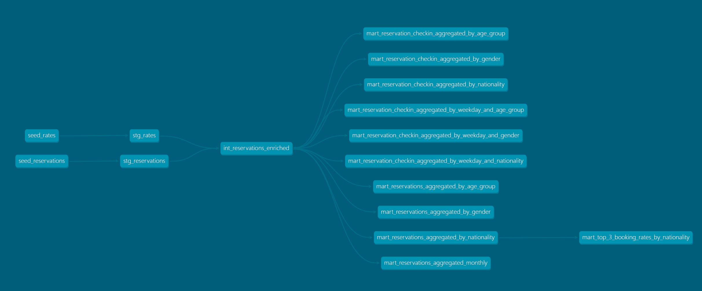

# Mews Data Analyst Task

This is a solution to the MEWS Data Analyst Task available [here](https://github.com/MewsSystems/developers/blob/726685ffd908770928413f58302d0a3c70bab550/jobs/Data/Readme.md).
Input CSV files are loaded into a Postgres database in a docker container using dbt seeds. Then, data is staged, transformed, and prepared for analysis for either an ad-hoc report or consumption by the Power BI dashboard prepared.

## Project Structure

The project is divided into an assignment folder with all the necessary instructions and data to work on it, and a solution folder with all the development associated with the solution. The solution contains a dbt project where all the modeling happens, as well as a reports folder where the ad-hoc report and Power BI report is. A `docker-compose.yml` is also present in the root directory of the project so that users can spin up the database and run / view the dbt models themselves.

## Deliverables

- A dbt project with all the modeling following a medallion architecture, including documentation and data testing.
- An ad-hoc report based on the modeled data which digs into customer behaviour related to booking rates, online check-in and profitability by segments. You can find the report [here](solution/reports/ad_hoc_report/customer_profile_report.md)
- A Power BI report with the following pages:
    - Rate Analysis
    - Temporal Analysis
    - Profitability
    - Simulation

    For more details, see the [user guide](solution/reports/pbi/customer_profile_pbi_report_user_guide.md)

## Prerequisites

- Python is required to run the dbt models. For more information on how to install it, go [here](https://www.python.org/downloads/)
- Docker is required to build and run the project in a containerized environment. You can visit [here](https://docs.docker.com/desktop/install/windows-install/) for more information on how to install docker.

## Setup Instructions

### Step 1: Clone the Repository

First, clone the repository in the desired folder by running:

```bash
git clone https://github.com/alecab94/mews-data-task
```

### Step 2: Build the Docker Image

From the project root (mews-data-task/) directory, run:

```bash
docker-compose up --build
```

This will create a Docker container with the Postgres database and the PgAdmin instance.

### Step 3: Create a virtual environment and install dependencies

In the project root directory, run the following command to create a virtual environment

```bash
python3 -m venv venv
```

Then, activate the virtual environment with:

```bash
source venv/bin/activate
```

Finally, install the required dependencies:

```bash
pip install -r requirements.txt
```

### Step 4: Run dbt models

First navigate to the dbt_project folder from the project root:

```bash
cd solution/dbt_project/
```
Now you can run `dbt debug` to test the connection to the database. Remember you must be connected to the virtual environment

### Optional: View the databse with pgadmin

Once the container is up, you can access the postgres database using the the credentials and interface with it using pgadmin by opening [http://localhost:8081](http://localhost:8081) in your browser.

#### Database Credentials

      user: mews_user
      password: postgres_password
      database: mews-data-task-db

#### Pgadmin Credentials

      email: employee@mews.com
      password: pgadmin_password

### dbt Project Structure

More details about the dbt project, and model documentation can be seen by running the following in the dbt project directory:

```bash
dbt docs generate
dbt docs serve
```

