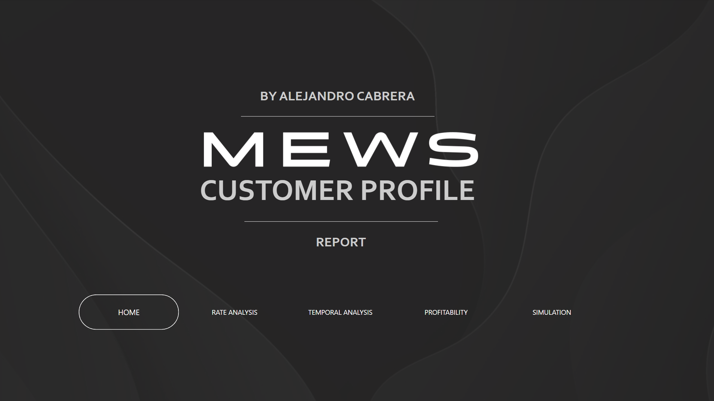
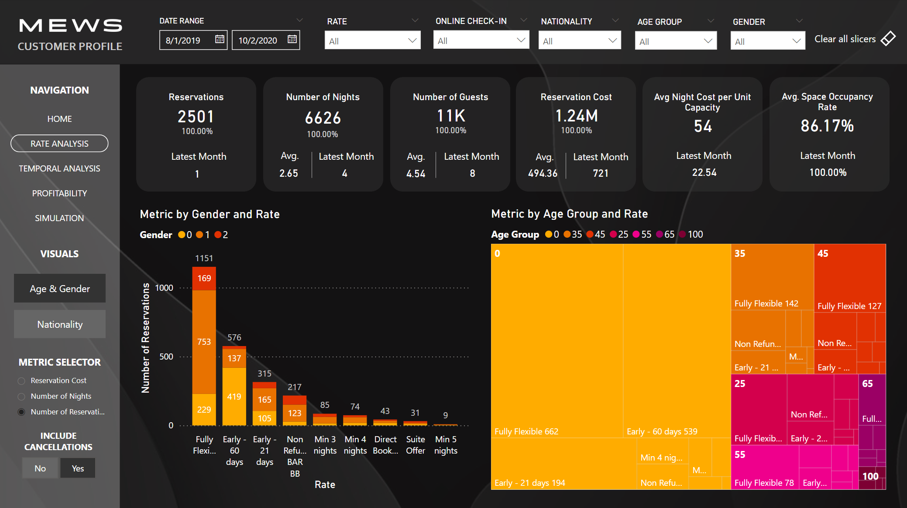
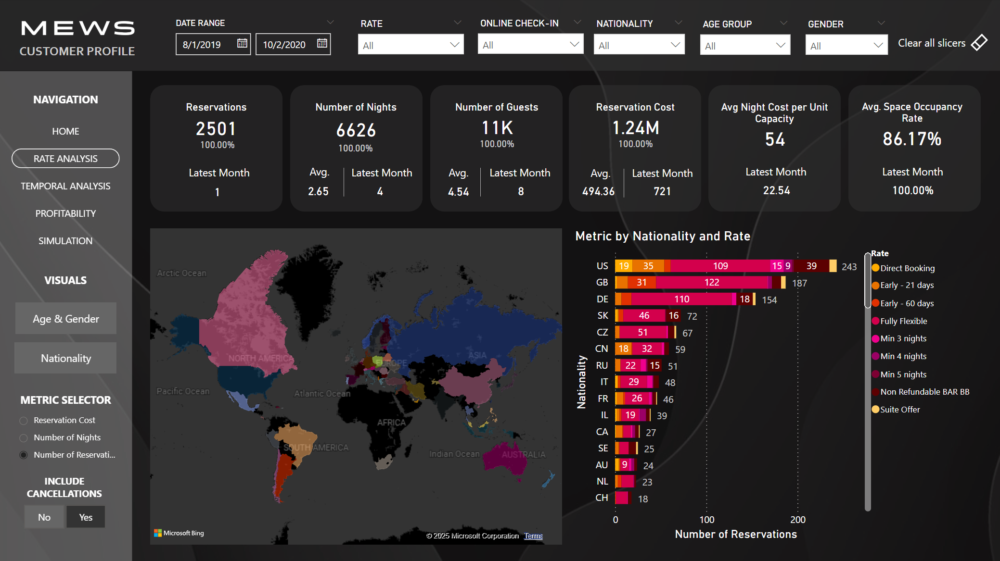
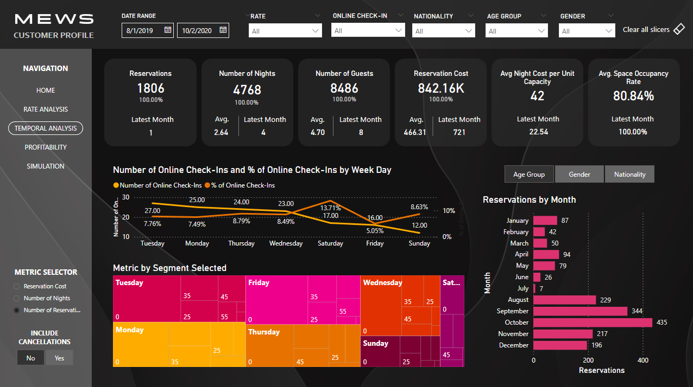
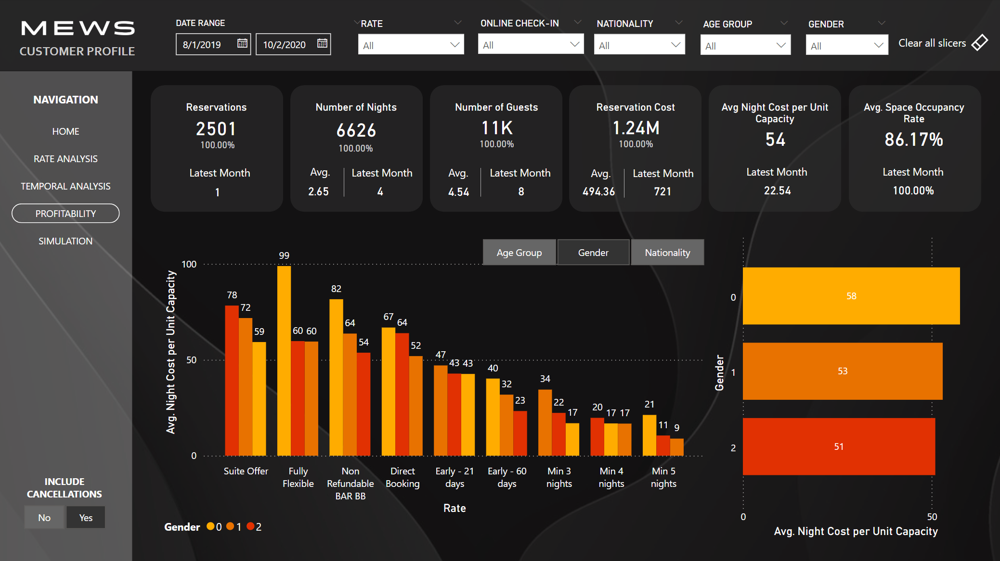
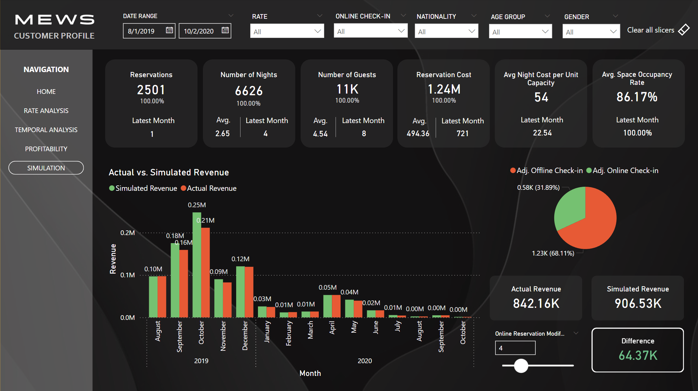

# Customer Profile Dashboard User Guide

## Overview

This dashboard allows comprehensive analysis of hotel reservations across various dimensions including demographics (gender, age, nationality), booking rates, temporal patterns, and profitability metrics. Additionally, the dashboard features a simulation tool that evaluates potential revenue impacts resulting from changes in online check-in participation.

## Navigation

The dashboard is organized into clear, distinct sections, accessible via the left sidebar:

- **Home:** Landing page.
- **Rate Analysis:** Analyze booking rates across demographic groups.
- **Temporal Analysis:** Investigate reservation trends over months and weekdays across demographic groups..
- **Profitability:** Assess average cost per single unit by demographic segments and booking rates.
- **Simulation:** Evaluate revenue scenarios based on online check-in participation.

## Slicers & Filters

Each page provides interactive slicers located at the top, enabling dynamic filtering:

- **Date Range:** Filter by a reservation date range.
- **Rate:** Filter reservations by booking rate types.
- **Online Check-In:** Filter by reservations that used or didn't use online check-in.
- **Nationality:** Filter data by guest nationality.
- **Age Group:** Segment reservations by age groups.
- **Gender:** Filter reservations by gender.

Additionally, the dashboard includes a convenient "Clear all slicers" button to reset them quickly.

## Key Features by Page

### Home

Landing page of the report where you can quickly navigate to the desired page

### Rate Analysis

- Available in left sidebar

    - **Views:**
        - **Age & Gender:** Displays reservation metrics by gender and age group.
        - **Nationality:** Displays reservation metrics by nationality.

    Switch between these two views using the bookmarks available on the left sidebar under "Visuals."

    - **Metric Selector:**
    Choose the metric you'd like to explore:
        - Reservation Cost
        - Number of Nights
        - Number of Reservations

    - **Include Cancellations Toggle:**
        - **Yes:** Includes all reservations, including those that were canceled.
        - **No:** Includes only reservations not canceled, establishing a new baseline.

### Temporal Analysis

- Analyze temporal reservation patterns segmented by:
  - **Month:** Visualize trends month-over-month.
  - **Weekday:** Observe reservation behaviors throughout the week, including online check-in.

- Choose to display visuals according to the demographic segments available:
  - Age Group
  - Gender
  - Nationality

- Available in left sidebar
    - **Metric Selector:**
    Choose the metric you'd like to explore:
        - Reservation Cost
        - Number of Nights
        - Number of Reservations

    - **Include Cancellations Toggle:**
        - **Yes:** Includes all reservations, including those that were canceled.
        - **No:** Includes only reservations not canceled, establishing a new baseline.

### Profitability

- Evaluate **Average Night Cost per Unit Capacity** to understand the profitability per booking.

- Analyze profitability by booking rate categories across different demographics:
  - **Age Group**
  - **Gender**
  - **Nationality**

- Availiable in left sidebar:
    - **Include Cancellations Toggle:**
    Choose to include or exclude cancellations as in other pages.

### Simulation

- **Objective:** Estimate revenue impacts when changing the proportion of reservations conducted via online check-in.

- **Interactive Slider (Online Reservation Modifier):**
  - Adjust this slider to simulate an increase or decrease in online check-ins.
  - Observe resulting changes in projected revenue compared to actual revenue.

- **Visualizations:**
  - **Bar Chart:** Displays actual vs. simulated monthly revenue.
  - **Pie Chart:** Illustrates the adjusted proportion of online vs. offline reservations.
  - **Cards:** Clearly indicate Actual Revenue, Simulated Revenue, and Revenue Difference.

